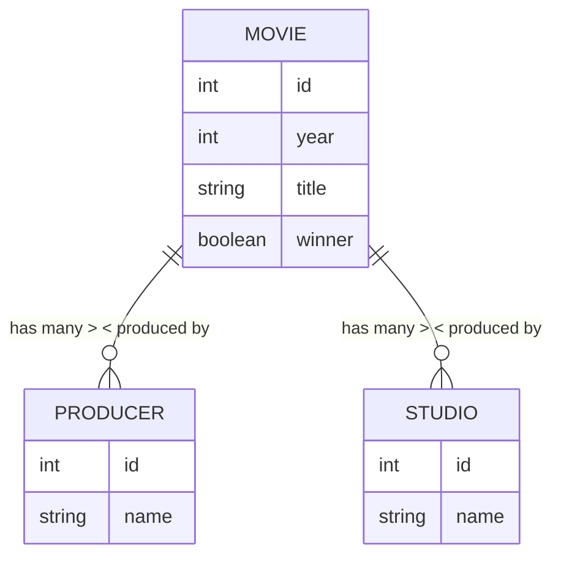

# 🎬 Golden Raspberry Awards API

RESTful API for reading and analyzing the list of nominees and winners of the "Worst Picture" category of the Golden Raspberry Awards (Razzie).

---

## 📋 Features

- 📅 Automatic reading of a CSV file with movie data on application startup
- 🧠 Persistent SQLite database stored at `src/database/golden-raspberry-api.sqlite`
- 🌐 RESTful endpoints for:
  - Listing all movies
  - Listing all studios
  - Listing all producers
  - Calculating award intervals for producers with multiple wins

---

## 🚀 Technologies

- [NestJS](https://nestjs.com/)
- [TypeORM](https://typeorm.io/)
- [SQLite](https://www.sqlite.org/index.html) (in-memory mode)
- [csv-parser](https://www.npmjs.com/package/csv-parser)
- [Jest](https://jestjs.io/) + [Supertest](https://www.npmjs.com/package/supertest)

---

## ▶️ How to run the project

1. Clone the repository:

   ```bash
   git clone https://github.com/douglaslopsou/golden-raspberry-api
   cd golden-raspberry-api
   ```

2. Install dependencies:

   ```bash
   yarn install
   # or
   npm install
   ```

3. Make sure the file `src/files/movielist_1.csv` exists and is in the correct format.

   Example of `movielist_1.csv`:

   ```csv
   year;title;studios;producers;winner
   1984;Bolero;Cannon Group;Bo Derek;yes
   1990;Ghosts Can't Do It;Triumph Releasing;Bo Derek;yes
   1991;Hudson Hawk;TriStar Pictures;Joel Silver;yes
   1992;Shining Through;20th Century Fox;Carol Baum;yes
   ```

4. Start the application:

   ```bash
   yarn start
   # or
   npm start
   ```

   The application will be available at [http://localhost:3000](http://localhost:3000)

---

## 📡 Endpoints

| Method | Route                       | Description                                             |
| ------ | --------------------------- | ------------------------------------------------------- |
| GET    | `/`                         | Health check                                            |
| GET    | `/movies`                   | List all movies                                         |
| GET    | `/studios`                  | List all studios                                        |
| GET    | `/producers`                | List all producers                                      |
| GET    | `/producers/award-interval` | Get producers with shortest and longest award intervals |

Example response for `/producers/award-interval`:

```json
{
  "min": [
    {
      "producer": "Joel Silver",
      "interval": 1,
      "previousWin": 1990,
      "followingWin": 1991
    }
  ],
  "max": [
    {
      "producer": "Bo Derek",
      "interval": 13,
      "previousWin": 1984,
      "followingWin": 1997
    }
  ]
}
```

---

## 🧰 Running e2e tests

```bash
yarn test:e2e
# or
npm run test:e2e
```

The tests ensure that the endpoints return data consistent with the movies read from the CSV.

---

## 📌 Notes

- ✅ The SQLite database is now persistent and saved at `src/database/golden-raspberry-api.sqlite`
- ✅ Follows Richardson Maturity Model Level 2 (resources and HTTP verbs)
- ✅ End-to-end tests implemented

---

## 📟 License

This project is licensed under the MIT License.

## Diagrama ER


